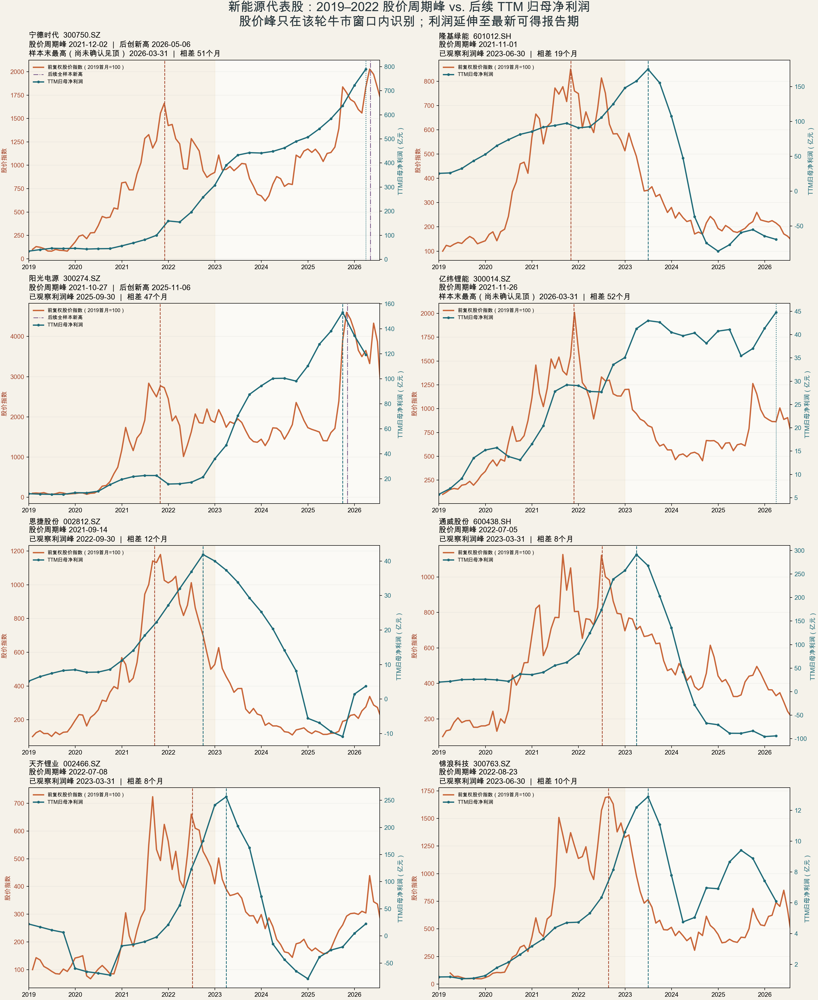
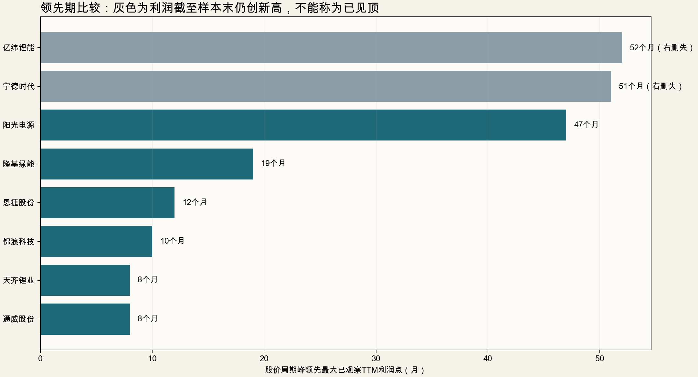

# 新能源代表股：股价是否总在财报利润之前见顶？

研究日期：2026-07-19  
样本：宁德时代、隆基绿能、阳光电源、亿纬锂能、恩捷股份、通威股份、天齐锂业、锦浪科技

## 先给结论

这个观点要拆成两个版本：

1. **窄口径命题成立：**把“股价顶”定义为 2019–2022 这一轮新能源牛市的周期最高收盘价，8 家公司的周期股价峰都早于此后最大已观察 TTM 归母净利润点，领先 8–52 个月，中位数 15.5 个月；按利润报告披露日计算，中位数为 17 个月。
2. **“总是”不成立：**若把“股价顶”改成 2019 年至 2026-07-17 的全样本最高收盘价，只有 6/8 早于最大已观察 TTM 利润点。宁德时代和阳光电源后来重新创出股价新高，构成反例。
3. **另有两家公司尚不能说利润已见顶：**宁德时代、亿纬锂能的最大 TTM 归母净利润恰好出现在最新可得的 2026Q1，属于右删失样本。只能说“周期股价峰早于当前最高已观察利润”，不能说已经观测到最终利润顶。
4. **真正可用于交易的结论不是“财报创新高就安全”，而是“股价交易未来利润斜率、供需和估值”。**六个已观察到利润回落的样本里，除后来完成再定价的阳光电源外，利润峰披露时股价相对旧周期峰已经低了约 46.6%–73.1%。等财报确认利润见顶，通常已经太晚。

因此，本轮证据支持的是：

> 在产能扩张型新能源周期中，旧周期股价高点通常领先绝对利润高点；但这是一条高概率周期规律，不是无条件定律，也不能把旧周期峰永久等同于公司历史股价峰。

## 统一口径

- 股价：前复权日收盘价。主检验的“周期峰”只在 `2019-01-01—2022-12-31` 内寻找；稳健性检验另看 `2019-01-01—2026-07-17` 全样本峰值。
- 利润：单季度归母净利润滚动四季之和，即 TTM 归母净利润；另以 TTM 扣非归母净利润和完整年度归母净利润复核。
- 利润日期：主表先用报告期末，再列实际披露日。二者不能混淆；市场只能在披露后看到最终报表，但会提前交易预期。
- “利润峰”：若最大值出现在最新一期，标记为“右删失”，不宣称真实峰值已经出现。
- 价格峰使用最高收盘价而不是盘中最高价。改用盘中最高价只会让部分日期移动数日或数月，不改变 8/8 的周期峰领先方向。

## 核心结果

| 公司 | 周期股价峰 | 最大已观察TTM期间 | TTM归母净利（亿元） | 领先期：期末（月） | 领先期：披露（月） | 利润披露时相对旧周期峰 | 利润状态 | 股价后来创新高 |
|:--|:--|:--|--:|--:|--:|--:|:--|:--|
| 宁德时代 | 2021-12-02 | 2026-03-31 | 789.76 | 51 | 52 | +23.58% | 样本末仍最高（右删失） | 是，2026-05-06 |
| 隆基绿能 | 2021-11-01 | 2023-06-30 | 175.09 | 19 | 21 | -62.75% | 已观察到回落 | 否 |
| 阳光电源 | 2021-10-27 | 2025-09-30 | 153.18 | 47 | 48 | +59.03% | 已观察到回落 | 是，2025-11-06 |
| 亿纬锂能 | 2021-11-26 | 2026-03-31 | 44.79 | 52 | 53 | -50.61% | 样本末仍最高（右删失） | 否 |
| 恩捷股份 | 2021-09-14 | 2022-09-30 | 41.88 | 12 | 13 | -48.86% | 已观察到回落 | 否 |
| 通威股份 | 2022-07-05 | 2023-03-31 | 291.41 | 8 | 9 | -46.57% | 已观察到回落 | 否 |
| 天齐锂业 | 2022-07-08 | 2023-03-31 | 256.72 | 8 | 9 | -53.42% | 已观察到回落 | 否 |
| 锦浪科技 | 2022-08-23 | 2023-06-30 | 12.89 | 10 | 12 | -73.13% | 已观察到回落 | 否 |

注：正数表示后来股价已经越过旧周期峰，不是“从历史最高点回撤”。宁德时代与阳光电源正是“总是”命题的两个重要反例。

## 年度利润复核

| 公司 | 最大已观察完整年度 | 年度归母净利润（亿元） | 是否为最新完整年度 |
|:--|--:|--:|:--|
| 宁德时代 | 2025 | 722.01 | 是 |
| 隆基绿能 | 2022 | 148.12 | 否 |
| 阳光电源 | 2025 | 134.61 | 是 |
| 亿纬锂能 | 2025 | 41.34 | 是 |
| 恩捷股份 | 2022 | 40.00 | 否 |
| 通威股份 | 2022 | 257.34 | 否 |
| 天齐锂业 | 2022 | 241.25 | 否 |
| 锦浪科技 | 2022 | 10.60 | 否 |

用年度口径复核，8 家公司的新能源周期股价峰也都早于最大已观察完整年度利润的年末。扣非 TTM 口径同样是 8/8 在周期股价峰之后达到最大已观察值，说明主结果不是由单一非经常性损益造成。

## 图形

## 为什么会这样

以下是解释，不是从数据中直接证明的因果事实：

- **股价看未来，不看当期绝对利润。**当市场开始预期未来量价、毛利率或资本回报率转弱，即使当期利润仍增长，估值倍数也可以先收缩。
- **利润是滞后确认项。**订单、售价和成本变化经过交付与会计确认才进入利润表；TTM 又天然包含前三个季度，所以绝对利润峰更滞后。
- **产能周期放大领先关系。**光伏、锂矿、隔膜等环节在高景气期集中扩产，股价会提前交易供给释放、价格下跌和利润率回落。
- **市场通常先交易利润增速的拐点，而不是利润金额的拐点。**所以“利润还在创新高”不能单独反驳股价下跌，也不能作为加仓理由。

## 个股分组理解

- **典型旧周期领先：隆基、恩捷、通威、天齐、锦浪。**股价高点后 8–21 个月，TTM 利润才见到最大已观察值；利润峰披露时，股价已相对旧峰下跌约 46.6%–73.1%。
- **利润仍未确认见顶：宁德、亿纬。**二者最新 2026Q1 TTM 仍是样本内最高，不能硬标“利润顶”。但亿纬股价仍比 2021 周期峰低约一半，说明利润规模与估值/预期不是一回事。
- **旧周期峰后重新定价：宁德、阳光。**两者后来股价超过 2021 周期峰，说明同一家公司的新业务、利润台阶或估值中枢变化可以形成新周期。旧峰只属于旧周期，不是永久天花板。

## 不能从这 8 家推出什么

1. 不能证明所有股票、所有行业都满足该规律。
2. 不能证明每一次局部股价高点都领先财报利润高点。
3. 不能把“财报还会增长”直接翻译成“股价还会涨”。
4. 不能把“股价先跌”自动解释成市场一定提前知道内幕；更常见的解释是预期、估值、供需和资金成本变化。
5. 不能忽略样本选择偏差：这 8 家是事后挑出的新能源代表公司，不是 2019 年事前固定的完整股票池。

## 若要把观点升级成统计规则

下一步应固定 2019 年末时点的新能源指数成份或申万电力设备成份，保留后来退市、被重组和表现差的公司，至少扩展到 30–50 家；统一识别行业指数周期峰，再比较每家公司价格峰与 TTM 归母、TTM 扣非、利润增速峰、毛利率峰和经营现金流峰。最终报告领先比例、中位数、四分位数及符号检验结果。只有这样，才有资格把“代表股观察”升级为“可重复统计规律”。

## 证据与数据源

| 证据 | 类型 | 来源与日期 | 用途 |
|:--|:--|:--|:--|
| 日线前复权行情 | FACT / 聚合数据 | [AKShare 股票数据文档](https://akshare.akfamily.xyz/data/stock/stock.html)，本次提取 2026-07-19；底层为东方财富接口 | 识别周期及全样本最高收盘价 |
| 单季度利润表 | FACT / 聚合数据 | AKShare `stock_profit_sheet_by_quarterly_em`，本次提取 2026-07-19；底层为东方财富财务分析 | 构造单季利润、TTM归母及扣非利润 |
| 宁德时代2025年报 | Level 1 | [巨潮资讯，2026-03-10](https://static.cninfo.com.cn/finalpage/2026-03-10/1225002214.PDF) | 核对2025年归母净利722.01亿元及季度拆分 |
| 阳光电源2025年报 | Level 1 | [巨潮资讯，2026-04-01](https://static.cninfo.com.cn/finalpage/2026-04-01/1225066678.PDF) | 核对2025年归母净利134.61亿元及季度拆分 |
| 亿纬锂能2025年报 | Level 1 | [中国货币网，2026-04-03](https://www.chinamoney.com.cn/chinese/cwbg/20260403/3309810.html) | 核对最新完整年度财报 |
| 隆基绿能2022年报 | Level 1 | [巨潮资讯，2023-04-28](https://static.cninfo.com.cn/finalpage/2023-04-28/1216664294.PDF) | 核对2022年利润高点年度 |
| 恩捷股份2023年报 | Level 1 | [巨潮资讯，2024-04-25](https://static.cninfo.com.cn/finalpage/2024-04-25/1219795065.PDF) | 以比较数据核对2022年归母净利40.00亿元 |
| 通威股份定期报告入口 | Level 1 | [公司信息披露页](https://www.tongwei.cn/index.php/information/list/7.html) | 核对2022年报及后续报告 |
| 天齐锂业公告入口 | Level 1 | [巨潮资讯全文检索](https://www.cninfo.com.cn/new/fulltextSearch?keyWord=002466) | 核对2022年报及后续报告 |
| 锦浪科技2022年报 | Level 1 | [深交所，2023-04-24](https://disc.static.szse.cn/disc/disk03/finalpage/2023-04-24/cf085ff1-6061-4d6d-ba03-56704a861c8f.PDF) | 核对2022年利润高点年度 |

### 数据限制

- 仓库自建 TuShare Token 在 2026-07-19 查询时返回“已过期”，因此本次行情和单季利润明细改用 AKShare/东方财富聚合接口；脚本和元数据保留了回退原因。
- 聚合接口可能随上市公司追溯调整而更新历史值，本报告使用 2026-07-19 可见版本。
- 数据截至行情 2026-07-17、财务报告期 2026Q1。后续财报可能改变宁德时代、亿纬锂能以及其他公司的最大已观察利润点。

## 可复核文件

- `analyze_price_profit_peaks.py`：完整提取、清洗、计算和作图脚本。
- `data/peak_summary.csv`：峰值和领先期汇总。
- `data/source_metadata.json`：每家公司实际使用的数据源、复权与回退说明。
- `data/*_price_qfq.csv`：日线前复权行情。
- `data/*_quarterly_profit.csv`：单季度及TTM利润序列。
- `charts/price_vs_ttm_profit_8stocks.png`：八家公司对比图。
- `charts/peak_lead_months.png`：领先期图。
